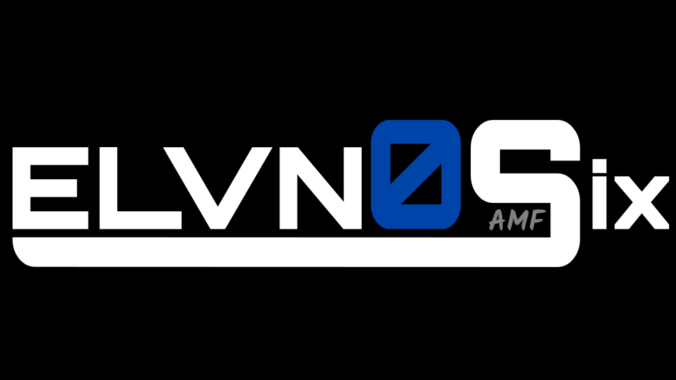

<!-- PROJECT LOGO -->
 

  

  <h3 align="center">PNEUMONIA.ELVNOSIX</h3>

  

    A WEB APPLICATION THAT DETECTS SIGNS OF PNEUMONIA FROM CHEST X-RAY SCANS
     
     
    <a href="https://github.com/Manjaka97/pneumonia.elvnosix/issues">Report Bug or Request Feature</a>
  

<!-- TABLE OF CONTENTS -->
## Table of Contents

* [About the Project](#about-the-project)
* [Demo](#demo)
* [Built With](#built-with)
* [License](#license)
* [Contact](#contact)

<!-- ABOUT THE PROJECT -->
## About The Project

![product-screenshot]

[pneumonia.elvnosix.com](https://pneumonia.elvnosix.com) is a simple web application that takes a chest X-ray image as an input and detects signs of Pneumonia infection on that image. That image is fed to a neural network which, if any signs are found, will draw bounding boxes around them and output that image back to the user. This whole process takes between 2-10 seconds on average. This project is mostly just a proof of concept, so the server has not been allocated a lot of resources. Therefore, testing sometimes may result in an error when the neural network uses too much memory. In that case, simply refresh the page and try again, and all should be well!

<!-- DEMO -->
## Demo

![demo]

<!-- built-with -->
## Built With

* [Yolov4](https://github.com/AlexeyAB/darknet)
* [OpenCV](https://opencv.org/)
* [Flask](https://flask.palletsprojects.com/en/2.0.x/)

<!-- LICENSE -->
## License

Distributed under the MIT License. See `LICENSE` for more information.

<!-- CONTACT -->
## Contact

* Manjaka Andriamasinoro 
* Email: manjaka.andriamasinoro@gmail.com / elvnosix@gmail.com
* LinkedIn: [https://www.linkedin.com/in/manjaka-andriamasinoro/](https://www.linkedin.com/in/manjaka-andriamasinoro/)

* Project Link: [https://github.com/Manjaka97/scrabble-trainer/](https://github.com/Manjaka97/scrabble-trainer/)

<!-- MARKDOWN LINKS & IMAGES -->
[license-url]: https://github.com/Manjaka97/scrabble-trainer/blob/master/LICENSE
[linkedin-url]: https://www.linkedin.com/in/manjaka-andriamasinoro/
[product-screenshot]: images/screenshot.PNG
[demo]: images/demo.gif